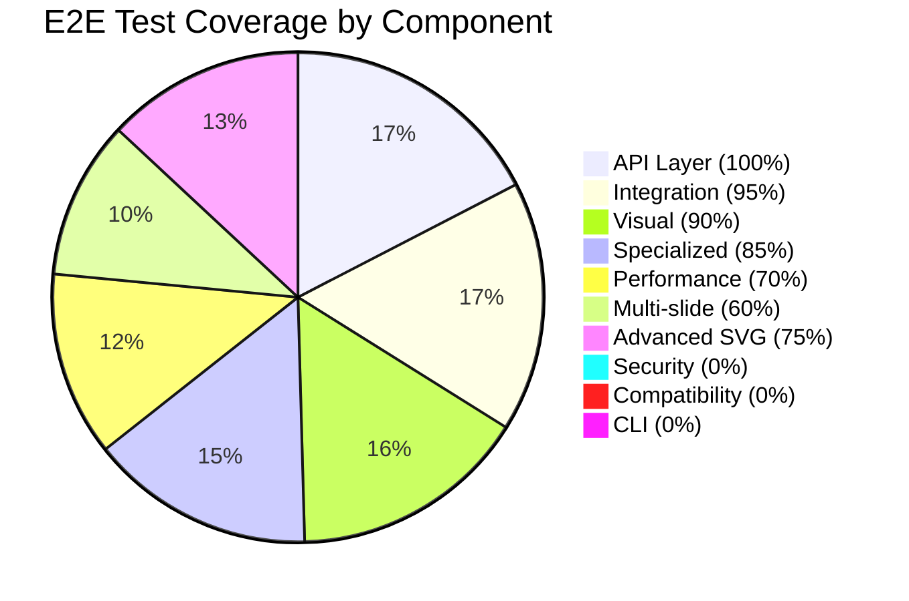
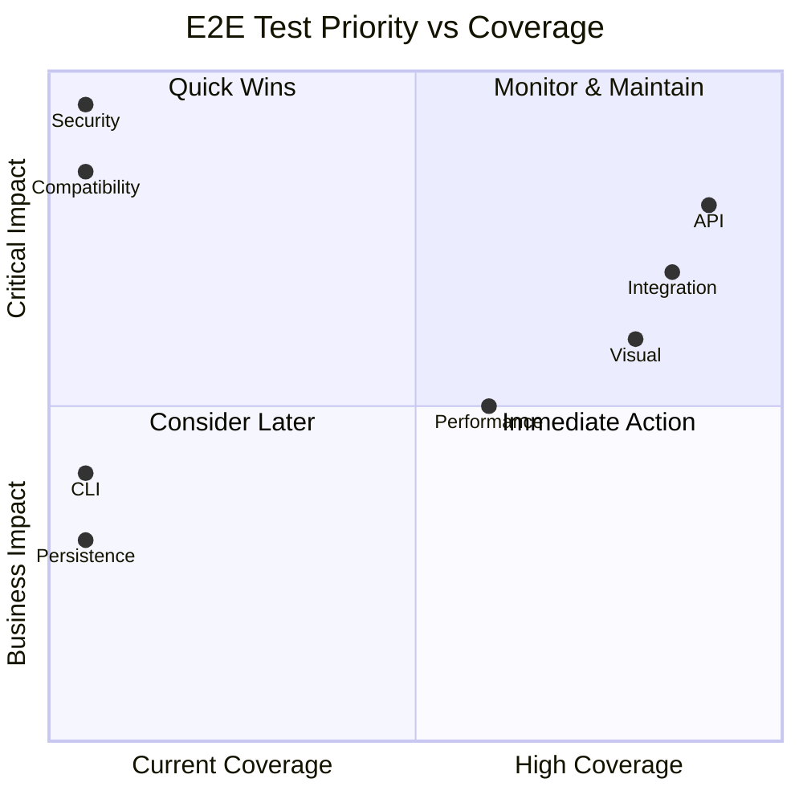
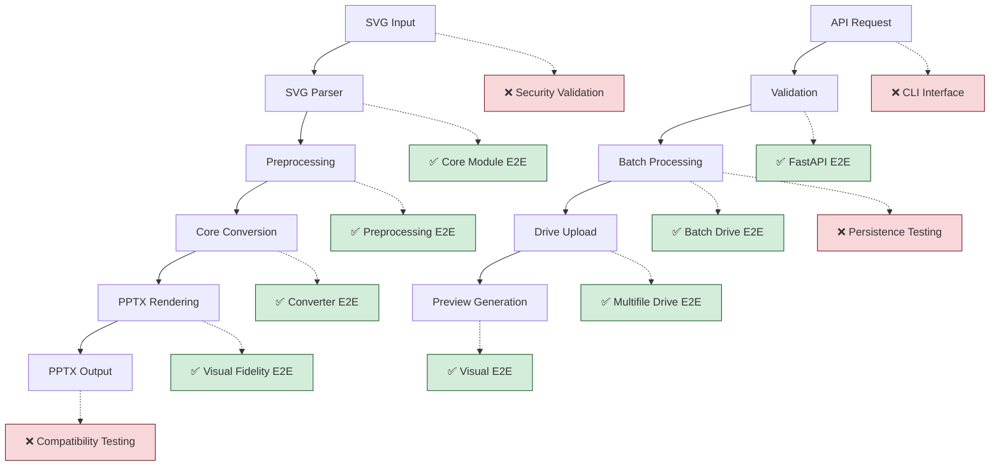
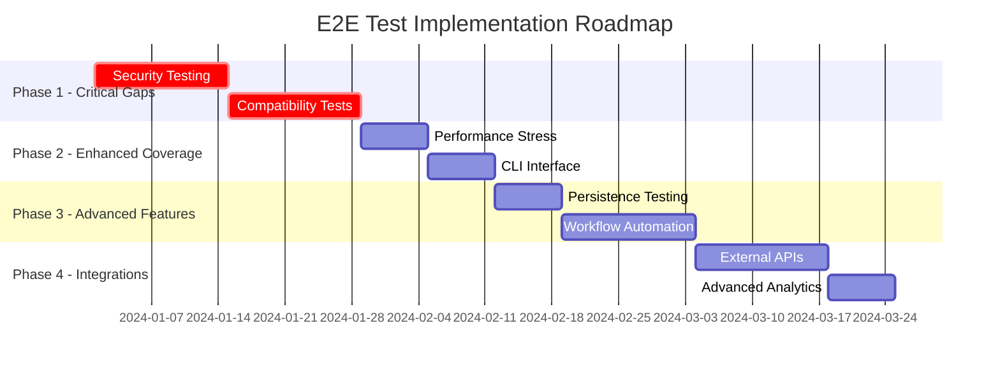

# SVG2PPTX E2E Test Coverage Visual Diagram

```mermaid
graph TD
    subgraph "SVG2PPTX E2E Test Coverage Analysis"
        subgraph "✅ EXISTING E2E TESTS (14 files)"
            API["`**API Layer (7 files)**
            🟢 100% Coverage
            • FastAPI endpoints
            • Batch processing
            • Drive integration
            • Authentication
            • Error handling
            • Performance baselines`"]

            INTEGRATION["`**Integration (2 files)**
            🟢 95% Coverage
            • Core module testing
            • Converter validation
            • Pipeline integration
            • Error scenarios`"]

            VISUAL["`**Visual (1 file)**
            🟢 90% Coverage
            • Pixel comparison
            • Layout preservation
            • Color fidelity
            • Report generation`"]

            LIBRARY["`**Library (1 file)**
            🟢 100% Coverage
            • Test data management
            • SVG test library
            • Metadata validation`"]

            SPECIALIZED["`**Specialized (3 files)**
            🟡 85% Coverage
            • Filter effects
            • Mesh gradients
            • Preprocessing pipeline`"]
        end

        subgraph "⚠️ PARTIALLY COVERED AREAS"
            PERF["`**Performance**
            🟡 70% Coverage
            ❌ Missing:
            • Large file processing
            • Memory stress testing
            • Caching validation
            • Parallel processing`"]

            MULTISLIDE["`**Multi-slide**
            🟡 60% Coverage
            ❌ Missing:
            • Complex layouts
            • Slide transitions
            • Master templates
            • Slide ordering`"]

            ADVANCED["`**Advanced SVG**
            🟡 75% Coverage
            ❌ Missing:
            • Complex filter chains
            • Irregular mesh grids
            • Animation conversion
            • Pattern tiles`"]
        end

        subgraph "❌ MISSING E2E TEST AREAS"
            SECURITY["`**Security (0%)**
            🔴 Critical Gap
            • Malicious SVG handling
            • XML entity expansion
            • File size limits
            • Input sanitization`"]

            COMPAT["`**Compatibility (0%)**
            🔴 Critical Gap
            • Font fallbacks
            • Platform rendering
            • PowerPoint versions
            • Office365 compatibility`"]

            CLI["`**CLI Interface (0%)**
            🟡 Medium Priority
            • Command validation
            • Batch operations
            • Configuration mgmt`"]

            PERSIST["`**Persistence (0%)**
            🟡 Medium Priority
            • Job persistence
            • Database migrations
            • Data recovery`"]

            WORKFLOWS["`**Workflows (0%)**
            🟢 Low Priority
            • Template conversion
            • Directory processing
            • Watch folder automation`"]

            EXTERNAL["`**External Integrations (0%)**
            🟢 Low Priority
            • Google Slides API
            • Dropbox integration
            • Webhook notifications`"]
        end
    end

    subgraph "SOURCE MODULES TO COVER (99 modules)"
        SRC_API["`**API Modules**
        src/batch/api.py
        src/batch/simple_api.py
        src/batch/tasks.py
        src/batch/drive_tasks.py`"]

        SRC_CORE["`**Core Conversion**
        src/svg2pptx.py
        src/svg2drawingml.py
        src/converters/*.py
        src/transforms.py
        src/colors.py`"]

        SRC_BATCH["`**Batch Processing**
        src/batch/worker.py
        src/batch/models.py
        src/batch/huey_app.py
        src/batch/drive_controller.py`"]

        SRC_FILTERS["`**Advanced Features**
        src/converters/filters/
        src/preprocessing/
        src/performance/
        src/multislide/`"]
    end

    %% Connections showing coverage relationships
    API --> SRC_API
    API --> SRC_BATCH
    INTEGRATION --> SRC_CORE
    VISUAL --> SRC_CORE
    SPECIALIZED --> SRC_FILTERS

    %% Missing connections (shown as dashed)
    SECURITY -.-> SRC_CORE
    COMPAT -.-> SRC_CORE
    CLI -.-> SRC_API
    PERSIST -.-> SRC_BATCH

    %% Styling
    classDef covered fill:#d4edda,stroke:#155724,stroke-width:2px
    classDef partial fill:#fff3cd,stroke:#856404,stroke-width:2px
    classDef missing fill:#f8d7da,stroke:#721c24,stroke-width:2px
    classDef source fill:#e2e3e5,stroke:#495057,stroke-width:1px

    class API,INTEGRATION,VISUAL,LIBRARY covered
    class SPECIALIZED,PERF,MULTISLIDE,ADVANCED partial
    class SECURITY,COMPAT,CLI,PERSIST,WORKFLOWS,EXTERNAL missing
    class SRC_API,SRC_CORE,SRC_BATCH,SRC_FILTERS source
```

## Coverage Statistics Dashboard

```mermaid
pie title E2E Test Coverage by Component
    "API Layer (100%)" : 20
    "Integration (95%)" : 19
    "Visual (90%)" : 18
    "Specialized (85%)" : 17
    "Performance (70%)" : 14
    "Multi-slide (60%)" : 12
    "Advanced SVG (75%)" : 15
    "Security (0%)" : 0
    "Compatibility (0%)" : 0
    "CLI (0%)" : 0
```

## Test Priority Matrix

```mermaid
quadrantChart
    title E2E Test Priority vs Coverage
    x-axis "Current Coverage" --> "High Coverage"
    y-axis "Business Impact" --> "Critical Impact"

    quadrant-1 "Monitor & Maintain"
    quadrant-2 "Quick Wins"
    quadrant-3 "Consider Later"
    quadrant-4 "Immediate Action"

    API: [0.9, 0.8]
    Integration: [0.85, 0.7]
    Visual: [0.8, 0.6]
    Performance: [0.6, 0.5]
    Security: [0.05, 0.95]
    Compatibility: [0.05, 0.85]
    CLI: [0.05, 0.4]
    Persistence: [0.05, 0.3]
```

## Test Structure Overview

```mermaid
graph LR
    subgraph "E2E Test Architecture"
        ROOT[tests/e2e/]

        subgraph "API Tests (7 files)"
            API1[test_fastapi_e2e.py]
            API2[test_batch_drive_e2e.py]
            API3[test_batch_multifile_drive_e2e.py]
            API4[test_batch_zip_simple_e2e.py]
            API5[test_batch_zip_structure_e2e.py]
            API6[test_httpx_client_e2e.py]
            API7[test_multipart_upload_e2e.py]
        end

        subgraph "Integration Tests (2 files)"
            INT1[test_core_module_e2e.py]
            INT2[test_converter_specific_e2e.py]
        end

        subgraph "Specialized Tests (4 files)"
            SPEC1[test_visual_fidelity_e2e.py]
            SPEC2[test_svg_test_library_e2e.py]
            SPEC3[test_filter_effects_end_to_end.py]
            SPEC4[test_mesh_gradient_e2e.py]
            SPEC5[test_preprocessing_pipeline_e2e.py]
        end

        ROOT --> API1
        ROOT --> API2
        ROOT --> API3
        ROOT --> API4
        ROOT --> API5
        ROOT --> API6
        ROOT --> API7
        ROOT --> INT1
        ROOT --> INT2
        ROOT --> SPEC1
        ROOT --> SPEC2
        ROOT --> SPEC3
        ROOT --> SPEC4
        ROOT --> SPEC5
    end

    classDef api fill:#e3f2fd,stroke:#1976d2
    classDef integration fill:#f3e5f5,stroke:#7b1fa2
    classDef specialized fill:#e8f5e8,stroke:#388e3c

    class API1,API2,API3,API4,API5,API6,API7 api
    class INT1,INT2 integration
    class SPEC1,SPEC2,SPEC3,SPEC4,SPEC5 specialized
```

## Workflow Coverage Map

```mermaid
flowchart TD
    SVG[SVG Input] --> PARSE[SVG Parser]
    PARSE --> PREPROC[Preprocessing]
    PREPROC --> CONVERT[Core Conversion]
    CONVERT --> RENDER[PPTX Rendering]
    RENDER --> OUTPUT[PPTX Output]

    %% API Workflow
    API_IN[API Request] --> VALIDATE[Validation]
    VALIDATE --> BATCH[Batch Processing]
    BATCH --> DRIVE[Drive Upload]
    DRIVE --> PREVIEW[Preview Generation]

    %% Test Coverage Annotations
    PARSE -.-> T1[✅ Core Module E2E]
    PREPROC -.-> T2[✅ Preprocessing E2E]
    CONVERT -.-> T3[✅ Converter E2E]
    RENDER -.-> T4[✅ Visual Fidelity E2E]

    VALIDATE -.-> T5[✅ FastAPI E2E]
    BATCH -.-> T6[✅ Batch Drive E2E]
    DRIVE -.-> T7[✅ Multifile Drive E2E]
    PREVIEW -.-> T8[✅ Visual E2E]

    %% Missing Coverage
    SVG -.-> M1[❌ Security Validation]
    OUTPUT -.-> M2[❌ Compatibility Testing]
    API_IN -.-> M3[❌ CLI Interface]
    BATCH -.-> M4[❌ Persistence Testing]

    classDef covered fill:#d4edda,stroke:#155724
    classDef missing fill:#f8d7da,stroke:#721c24

    class T1,T2,T3,T4,T5,T6,T7,T8 covered
    class M1,M2,M3,M4 missing
```

## Implementation Roadmap

```mermaid
gantt
    title E2E Test Implementation Roadmap
    dateFormat  YYYY-MM-DD
    section Phase 1 - Critical Gaps
    Security Testing     :crit, security, 2024-01-01, 2w
    Compatibility Tests  :crit, compat, after security, 2w
    section Phase 2 - Enhanced Coverage
    Performance Stress   :perf, after compat, 1w
    CLI Interface       :cli, after perf, 1w
    section Phase 3 - Advanced Features
    Persistence Testing :persist, after cli, 1w
    Workflow Automation :workflow, after persist, 2w
    section Phase 4 - Integrations
    External APIs       :external, after workflow, 2w
    Advanced Analytics  :analytics, after external, 1w
```